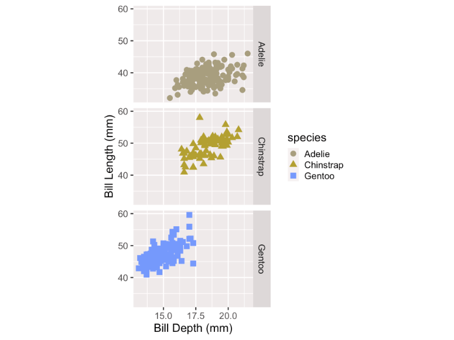
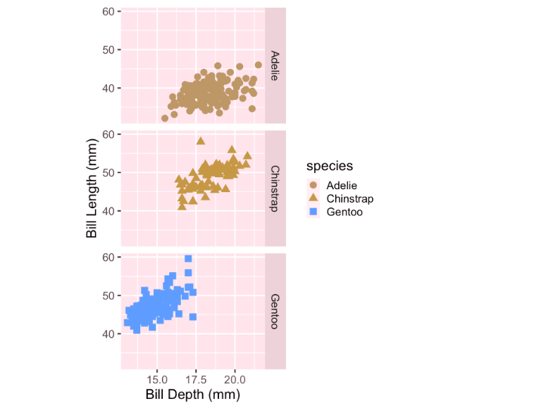
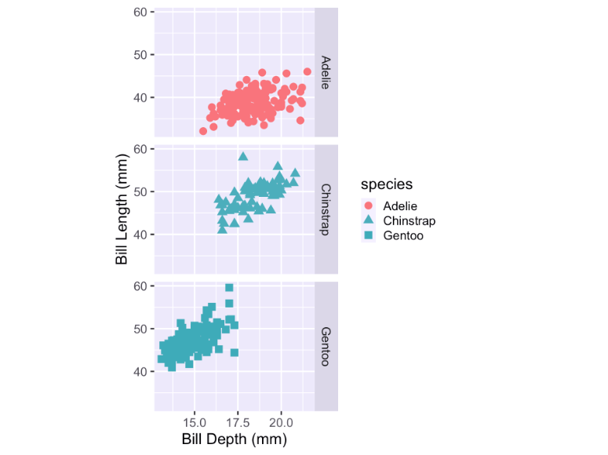
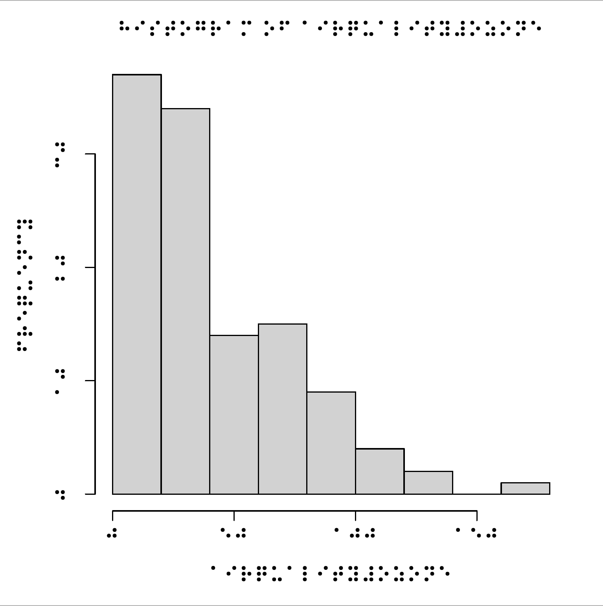

class: title-slide, middle

```{r setup, include=FALSE}
knitr::opts_chunk$set(echo=FALSE, warning=FALSE, message=FALSE)

library(tidyverse)
library(palmerpenguins)

xaringanExtra::use_slide_tone()
```


# `r rmarkdown::metadata$title`
## `r rmarkdown::metadata$author`
### `r rmarkdown::metadata$subtitle`
### `r rmarkdown::metadata$date`


---

class: middle


## Statistics


- 61 million adults in the United States live with a disability


- 26 percent (one in 4) of adults in the United States have some type of disability.


- 4.6 percent of people with a disability have a vision disability with blindness or serious difficulty seeing even when wearing glasses. 


[CDC Infographic on disability](https://www.cdc.gov/ncbddd/disabilityandhealth/infographic-disability-impacts-all.html)

---

class: middle


## ADA

Americans With Disabilities Act (ADA) of 1990 prohibits discrimination against individuals with disabilities in all areas of public life.

**Ableism** is discrimination in favor of able-bodied people.

---

class:center

```{r echo=FALSE, fig.align='center', out.width="25%", fig.alt="a hex shaped logo with shiny green-pink disco ball and purple starry background. There is text that says Bayes Rules!"}
knitr::include_graphics("img/bayes-rules-hex.png")
```


.pull-left[
<script src="https://use.fontawesome.com/releases/v5.15.1/js/all.js" data-auto-replace-svg="nest"></script>

<i class="fas fa-book fa-2x" aria-hidden="true" title="Book icon"></i>

[Bayes Rules! An Introduction to Applied Bayesian Modeling](https://bayesrulesbook.com)

]

.pull-right[

<i class="fab fa-r-project fa-2x" aria-hidden="true" title="R logo"></i>

[{bayesrules}](https://www.github.com/bayes-rules/bayesrules)
]

---


class: middle 

.pull-left[
.center[

 


Alicia Johnson          
.font-20[Macalester College]
        
[`r fontawesome::fa(name = "link")`](https://ajohns24.github.io/portfolio)
[`r fontawesome::fa(name = "github")`](https://github.com/ajohns24)

]
]

.pull-right[
.center[


Miles Ott  
.font-20[Twitter]

[`r fontawesome::fa(name = "link")`](https://milesott.com/)
[`r fontawesome::fa(name = "github")`](https://github.com/MilesOtt)
[`r fontawesome::fa(name = "twitter")`](https://twitter.com/Miles_Ott)

]
]

---


class: middle

[Dogucu, M., Johnson, A. A., & Ott, M. (2021). Framework for Accessible and Inclusive Teaching Materials for Statistics and Data Science Courses. arXiv preprint arXiv:2110.06355.](https://arxiv.org/abs/2110.06355)


---


class: center middle

### Accessibility and Inclusion

```{r checklist, echo=FALSE}
options(knitr.kable.NA = '')
readxl::read_xlsx("accessibility-checklist.xlsx") %>%  
  slice(1:3) %>% 
  knitr::kable() 
  
```


---

class: center middle


```{r checklist2, echo=FALSE}
readxl::read_xlsx("accessibility-checklist.xlsx") %>%  
  slice(4:5) %>% 
  knitr::kable() 
  
```

---

class: center middle


```{r checklist3, echo=FALSE}
readxl::read_xlsx("accessibility-checklist.xlsx") %>%  
  slice(6:11) %>% 
  knitr::kable() 
  
```


---

class: middle

## Teaching Accessibility

I was supported by the [Teach Access](https://teachaccess.org/) network. 


```{r echo=FALSE, fig.align='center', out.width="40%", fig.alt="Teach Access logo that is an illustration of a bridge"}
knitr::include_graphics("img/teach_access_logo.jpg")
```

---

class: middle

.center[


JooYoung Seo  
.font-20[University of Illonois Urbana-Champaign]

[`r fontawesome::fa(name = "link")`](https://jooyoungseo.github.io/)
[`r fontawesome::fa(name = "github")`](https://github.com/jooyoungseo)
[`r fontawesome::fa(name = "twitter")`](https://twitter.com/seo_jooyoung)

]
---
class: middle

[Computing Competencies for Undergraduate Data Science Curricula](https://dstf.acm.org/DSReportDraft2Full.pdf) by Association for Computing Machinery (ACM) Data Science Task Force

Draft 2 was published in **December 2019**

Analysis and Presentation, Foundational considerations, Knowledge


**Accessibility considerations for different groupings of users including those with special needs**

---

class: middle

## Accessibility as Career Preparation

[Accessible Technology Skills Gap Report  by The Partnership on Employment & Accessible Technology (PEAT), 2018](https://www.peatworks.org/infographic-the-accessible-technology-skills-gap/)

84% of industry respondents say it is important or very important to their company to hire developers and designers with accessible technology skills.


60% said it was difficult or very difficult for their organization to find job candidates with accessibility skills. 0% said it was easy or very easy.


41% of companies consider accessibility certification credentials as a differentiator in hiring.

---

class: middle

## Curriculum Goal

As educators, we have to ensure that the current and the next generation of data scientists, provide public-facing outputs (websites, analysis reports, etc.) that are accessible.


---

class: middle

## Learning Objectives

- Student should get familiar with American Disabilities Act. 
- Students should use at least one assistive technology (i.e. screen reader).
- Students should consider different representations of data.

---

class: middle

## Assistive Technology

- Assistive Technology is any form of technology (software, device) that helps people with disabilities perform certain activities. Examples:

- walking sticks
- wheel chairs
- screen readers

---

class: middle

## Screen reader


A screen reader is an assistive technology that supports blind or visually impaired people in using their computer. 

<!-- We can do a demo here-->

---

class: middle

Students can use screen reader on Windows and Mac

- If you are on a Windows machine go to Settings > Ease of Access > Narrator,and then turn on the toggle under Use Narrator.

- If you are on a Mac go to System Preferences > Accessibility > Voice Over > Enable Voice Over

---

class: middle

## Data Visualization - Colors


```{r echo = FALSE, warning=FALSE, fig.height=5, fig.align='center', fig.alt="Three separate scatterplots in three rows showing bill depth and bill length of three separate species of penguins Adelie, Chinstrap, and Gentoo respectively and the  points representing each observation are red, green, and blue respectively."}
library(palmerpenguins)
fig <- ggplot(penguins,
       aes(x = bill_depth_mm,
           y = bill_length_mm,
           shape = species,
           color = species)) +
  geom_point(size = 4) +
  facet_grid(species~.) +
  labs(x = "Bill Depth (mm)",
       y = "Bill Length (mm)")

fig
```

---

class: middle

### Color Blindness Simulator 

```{r echo=TRUE, eval=FALSE}
colorblindr::cvd_grid(fig)
```

```{r fig.align='center', out.width='45%', fig.alt="A 2 by 2 grid of four scatterplots. The scatterplots are the same as the scatterplot in the previous figure except for colors. From left to right and top to bottom the plots read deutanomly, protanomly, tritanomly, and desaturated"}
library(colorblindr)
cvd_grid(fig, severity = 1)
```


---

class: middle

[Color blindness simulation](https://www.color-blindness.com/coblis-color-blindness-simulator/): red-blind/protanopia

```{r echo=FALSE, out.width="60%", fig.align='center', fig.alt="The same scatterplots are displayed but Adelie and Chinstrap penguin data are shown with a very similar yellow-brownish green. There is no red visible."}

```

---

class: middle

[Color blindness simulation](https://www.color-blindness.com/coblis-color-blindness-simulator/): green-blind/deuteranopia

```{r echo=FALSE, out.width="60%", fig.align='center', fig.alt="The same scatterplots are displayed but Adelie and Chinstrap penguin data are shown with a very similar yellow-brownish green. There is no red visible. The gray background is also a bright pink."}

```


---

class: middle

[Color blindness simulation](https://www.color-blindness.com/coblis-color-blindness-simulator/): blue-blind/tritanopia

```{r echo=FALSE, out.width="60%", fig.align='center', fig.alt="The same scatterplots are displayed but Adelie and Gentoo penguin data are shown with a very similar greenish blue."}

```

---

class: middle

### Okabe-Ito Color Palette 

```{r echo=TRUE}
palette.colors(palette = "Okabe-Ito")
```


---

class: middle


```{r eval=FALSE, echo=TRUE}
fig + colorblindr::scale_color_OkabeIto()
```


```{r fig.align='center', out.width='45%', fig.alt= "Three separate scatterplots in three rows showing bill depth and bill length of three separate species of penguins Adelie, Chinstrap, and Gentoo respectively and the  points representing each observation are orange, blue, and green respectively."}

fig + colorblindr::scale_color_OkabeIto()

```


---


class: middle

### Resources

[Color Blindness Simulator](https://www.color-blindness.com/coblis-color-blindness-simulator/) You can upload any image and in return get an image with colors that would be visible to color-blind people with specific color vision deficiency. 

[Okabe-Ito 2008](https://jfly.uni-koeln.de/color/)  Color Universal Design. Color palette that is color-blind friendly.

[Okabe-Ito color-palette](https://mikemol.github.io/technique/colorblind/2018/02/11/color-safe-palette.html) Color codes for Okabe-Ito palette. 


---

class: middle

## Data Verbalization

### Alternate Text

- "Alt text" describes contents of an image. 
- It is used in HTML pages. 
- Screen-readers cannot read images but can read alt text. 
- Alt text has to be provided. 
- We can verbalize data via alternate text.

---

class: center middle 

## (some) Chunk Options in R Markdown

<table align = "center">

<tr>

<td>echo = FALSE</td>
<td>hides the code</td>

</tr>


<tr>

<td>warning = FALSE</td>
<td>hides warning</td>

</tr>

<tr>

<td>error = TRUE</td>
<td>renders despite errors and displays the error</td>

</tr>

<tr>

<td>fig.cap = "Some figure caption"</td>
<td>creates a figure caption</td>

</tr>

<tr>

<td>fig.align = "center"</td>
<td>centers the figure in the page</td>

</tr>

<tr>

<td>fig.alt = "Some alternate text for figure"</td>
<td>creates alternate text for figures</td>

</tr>


</table>

---

class: middle

```{r fig.alt="GitHub issue created on RStudio's RMarkdown repo asking for fig.alt option to be created", fig.align='center', out.width="100%"}
knitr::include_graphics("img/alttext-github-issue.png")
```

---

class: middle

### Manual Alternate Text

- Chart type

- Type of data

- Reason for including the chart

- Link to data or source (not in alt text but in main text)

[Amy Cesal](https://medium.com/nightingale/writing-alt-text-for-data-visualization-2a218ef43f81)

---


class: middle

### Data Verbalization -  Automated

```{r echo=FALSE, fig.height=4}
mtcars <- mtcars %>% 
  mutate(transmission = if_else(am == 0, "automatic", "manual"))
```


```{r fig.align="center", fig.height=4}
example_barplot <- ggplot(mtcars, aes(x = transmission)) +
  geom_bar()
example_barplot
```

The automated alternate text for this plot is on the next slide.

---

class: middle

### Data Verbalization -  Automated


```{r echo=TRUE}
BrailleR::VI(example_barplot)
```

<hr>

Drawback of using `VI()` is that not every type of plot can be verbalized yet. 

---

class: middle

### Alternate Texts are Under Utilized in the Data Science Community

"Over the 3 years of TidyTuesday, there were 7,136 data viz tweets and only 215 (3%) of them had alt-text"

[Canelón & Hare, 2021 ](https://github.com/spcanelon/csvConf2021)

---

class: middle

## Data Sonification

Data sonification is the presentation of data as sound. 

Examples:

[SAS Graphics Accelerator Examples](https://support.sas.com/software/products/graphics-accelerator/samples/index.html)

[SAS Graphics Accelerator Chrome Extension](https://chrome.google.com/webstore/detail/sas-graphics-accelerator/ockmipfaiiahknplinepcaogdillgoko?hl=en)


R example:

```{r eval=FALSE, echo=TRUE}
sonify::sonify(1:10)
```

---

class: middle

## Data Tactualization

Data tactulization refers to making data visualization in a form so that it can be touchable by fingers. 


.center[

<iframe  width="560" height="315" src="https://www.youtube.com/embed/ClI555l4Z1M" title="YouTube video player" frameborder="0" allow="accelerometer; autoplay; clipboard-write; encrypted-media; gyroscope; picture-in-picture" allowfullscreen></iframe>

]


---

class: middle

## Data Tactualization


.pull-left[

```{r eval=FALSE, echo=TRUE}
library(tactileR)
brl_begin(file = 'tactile.pdf', 
          pt = 11, 
          paper = 'special', font='BRL')
hist(airquality$Ozone)
brl_end()
```

]

<!--the swell touch paper through swell form heating machine-->


.pull-right[

```{r echo=FALSE, fig.align='center', out.width="80%", fig.alt="A histogram with x and y labels, title displayed in Braille."}

```

]

---

class: middle

## When?


- Stats 5 - Seminar in Data Science

- ICS 80 - Introduction to Data Science

- Stats 295 - Scientific Computing with R


---

class: middle

## Important Take-Aways


-  Relevant to undergraduate and graduate curriculum

- Can be taught in language-specific and language-agnostic courses

- Students should be assessed on the practice of accessibility practices

- Students should be able to take away this knowledge to non-data specific courses.


---


class: middle center


## Thank you

<hr> 


Mine Dogucu

<i class="fa-solid fa-envelope" title="Email Icon"></i> [mdogucu@uci.edu](mailto:mdogucu@uci.edu)

<i class="fa-brands fa-twitter" title="Twitter Icon"></i> [MineDogucu](https://twitter.com/MineDogucu)

<i class="fa-brands fa-github" title="GitHub Icon"></i> [mdogucu](https://github.com/mdogucu)


